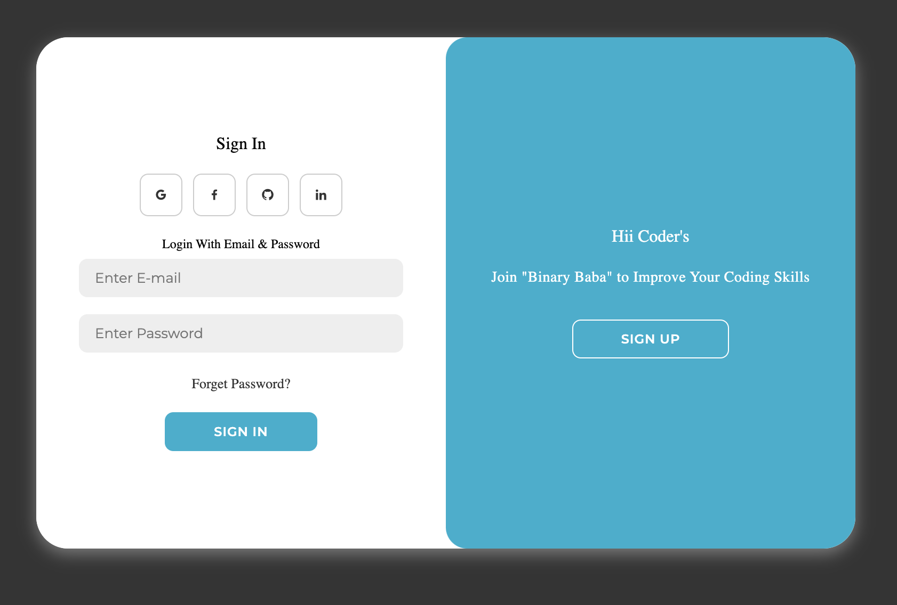
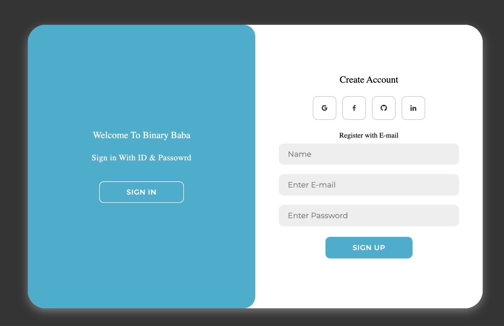

# Binary Baba Login Register UI

A modern, responsive login and registration page with a sliding toggle effect, built using HTML, CSS, and JavaScript. This project features a clean UI with social login icons and smooth animations, designed to enhance user experience.

## Features
- **Sign In/Sign Up Toggle:** Seamlessly switch between login and registration forms with a sliding animation.
- **Responsive Design:** Adapts to various screen sizes with a centered layout.
- **Social Icons:** Placeholder links for Google, Facebook, GitHub, and LinkedIn authentication.
- **Custom Styling:** Uses Montserrat font and Boxicons for a polished look.
- **Accessibility:** Includes screen-reader-friendly labels.
- **No Backend:** Pure front-end implementation (add your own backend for form submission).

## Screenshots
  


## Installation
1. Clone the repository:
   ```bash
   git clone https://github.com/yourusername/binary-baba-auth.git
   ```
2. Open `index.html` in your browser:
   ```bash
   open index.html
   ```
3. Customize the styles in `style.css` or functionality in `script.js` as needed.

## Dependencies
- [Montserrat Font](https://fonts.googleapis.com/css2?family=Montserrat) (via Google Fonts)
- [Boxicons](https://unpkg.com/boxicons@2.1.4/css/boxicons.min.css) (via CDN)

## Usage
- Click "Sign Up" to register a new account.
- Click "Sign In" to log in with existing credentials.
- Add your own backend logic by updating the `<form>` attributes (`action` and `method`).

## Contributing
Feel free to submit issues or pull requests to improve the project!

## Credits
Created for Binary Baba.
